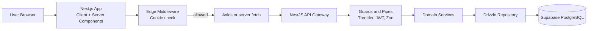
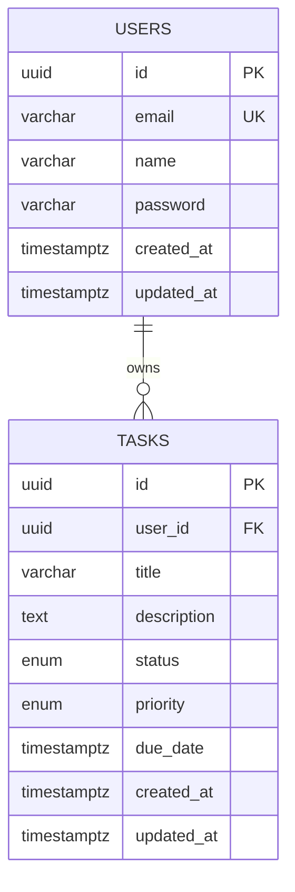
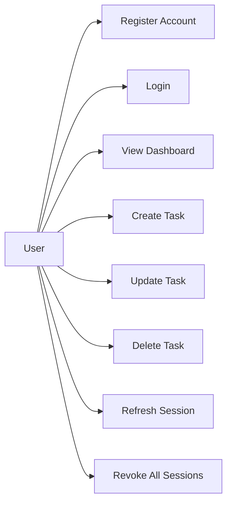

# Architecture Document — Task Management System

> Internal reference document. Not a deliverable — complements the 1-page [PLAN.md](PLAN.md).

> Implementation status (February 2026): backend and frontend are fully active — auth, protected routes, task CRUD, and session management are all implemented.

---

## 1. System Architecture

### 1.1 Architectural Pattern

**Monolithic Repository, Modular Backend.** Turborepo orchestrates a pnpm workspace containing two applications and five shared packages. The backend follows a **Modular Monolith** pattern via NestJS modules — each domain (Auth, Tasks) is a self-contained module with its own controller, service, and repository. This keeps the codebase simple for a single-developer assessment while demonstrating the structural discipline needed for team-scale systems.

### 1.2 Data Flow



---

## 2. Technology Stack — Detailed Justification

| Layer | Technology | Why This Over Alternatives |
|---|---|---|
| **Monorepo** | Turborepo + pnpm | Cached builds, shared `tsconfig`/`eslint`, strict package boundaries. pnpm's strict node_modules prevents phantom deps. |
| **Frontend** | Next.js (App Router) | Active for auth + protected-route flows. Remaining task UX improvements continue iteratively. |
| **UI** | Tailwind CSS + Shadcn/ui | shadcn component primitives with Tailwind token-based styling. Theme values come from semantic CSS variables and are switched by a theme provider for correct light/dark modes without hardcoded colors. |
| **HTTP Client** | Axios | Response interceptors handle 401s with single-flight token refresh and request retry queuing — concurrent requests recover transparently after token expiry. Only forces logout when the refresh itself is rejected. Transient network failures surface a recoverable error state. `fetch` lacks interceptors without wrapper boilerplate. |
| **State Mgmt** | TanStack Query | Server-state solution: handles `isLoading`, `isError`, `data`, cache invalidation, and optimistic updates. Dehydrate/hydrate pattern enables SSR → client handoff with zero loading flicker. Replaces manual `useEffect` patterns. |
| **Form Validation** | react-hook-form + Zod | Shares Zod schemas from `packages/contract`. Validation runs client-side before submission AND server-side via NestJS pipes — same rules, zero drift. |
| **Backend** | NestJS + Express | DI container enforces separation of concerns. Built-in support for Guards, Pipes, Interceptors, and Filters provides clean middleware layering without ad-hoc chains. |
| **ORM** | Drizzle ORM | Zero-runtime (no query engine binary like Prisma). SQL-aligned syntax reduces abstraction leaks. Type inference from schema → queries → responses. Edge-compatible (no WASM dependency). |
| **Database** | PostgreSQL (Supabase) | Relational integrity for `users.id → tasks.user_id`. Supabase adds RLS as defense-in-depth. Managed backups, connection pooling via PgBouncer. |
| **Hashing** | Argon2id | Winner of the Password Hashing Competition. Memory-hard: resistant to GPU/ASIC attacks. Configurable memory cost, time cost, parallelism. Superior to Bcrypt for modern threat models. |
| **Deployment** | Vercel + Render + Supabase | Vercel: native Next.js edge deployment. Render: Docker-based NestJS with auto-deploy from Git. Supabase: managed Postgres with free tier. All have reliable free tiers for assessment purposes. |

### 2.1 UI Theming Strategy

- Theme provider toggles `light` and `dark`.
- Colors come from semantic CSS variables consumed by Tailwind tokens.
- shadcn components consume semantic tokens instead of hardcoded hex values.
- Core text, surfaces, and interactive states target WCAG AA contrast.

---

## 3. Security Architecture — Deep Dive

### 3.1 Authentication: Session Records

Standard JWTs are stateless — once issued, they cannot be revoked until expiry. This implementation uses server-side session records for per-device revocation and refresh rotation.

**Database Schema:**
```
auth_sessions: { id, user_id, refresh_token_hash, expires_at, revoked_at }
```

**Login Flow:**
1. User submits credentials → server validates → Argon2id hash comparison.
2. Server creates an auth session row and generates access/refresh JWTs: `{ sub: user.id, sid: session.id, typ, iat, exp }`.
3. Tokens are placed in HttpOnly cookies (`access_token`, `refresh_token`) with environment-aware SameSite policy.
4. Browser stores cookie — JavaScript cannot read it (`HttpOnly`).

**Bootstrap Flow (Frontend):**
1. On page load the client calls `GET /auth/me` using the existing access token cookie — verifies the JWT and active session with no DB mutation.
2. On success → user is authenticated; no token rotation occurs.
3. On 401 (expired access token) → falls back to `POST /auth/refresh` to rotate the session and reissue tokens.
4. On network failure at either step → auth state moves to a recoverable error state; the user sees a retry UI and is not logged out.

**Request Authentication:**
1. `JwtAuthGuard` extracts token from cookie header.
2. Verifies JWT signature and expiry.
3. Loads user from DB.
4. **Checks:** active session check (`payload.sid` maps to non-revoked session).
5. Attaches `user` to request context via custom request decorators.

**Revocation:**
1. `POST /auth/logout` revokes only the current session (`auth_sessions.revoked_at = now`) and clears cookies.
2. `POST /auth/revoke` revokes all active sessions for the user.
3. `POST /auth/refresh` rotates the refresh token hash for the active session.

### 3.2 Cookie Security Flags

| Flag | Value | Purpose |
|---|---|---|
| `HttpOnly` | `true` | Prevents `document.cookie` access → mitigates XSS token theft |
| `Secure` | `true` | Cookie only sent over HTTPS → prevents MITM interception |
| `SameSite` | `Lax` (local dev) / `None` (production cross-site) | Allows cross-site deployment while preserving secure defaults |
| `Path` | `/` | Cookie available to all API routes |
| `Max-Age` | `900` (access) / `604800` (refresh) | Aligned with JWT `exp` claims: 15-minute access token, 7-day refresh token |

### 3.3 Defense-in-Depth Layers

| Layer | Mechanism | Threat Mitigated |
|---|---|---|
| **Transport** | HTTPS only (Secure cookie flag) | Man-in-the-middle |
| **Authentication** | JWT + Session Records | Session hijacking, stale tokens |
| **Authorization** | Ownership check in every task query (`WHERE user_id = $1`) | Horizontal privilege escalation |
| **Input** | Zod schema validation + `whitelist: true` (strip unknown fields) | Injection, mass assignment |
| **Rate Limiting** | ThrottlerModule: 5/min auth, 100/min data. Per-user buckets use only server-verified identity; unauthenticated requests are tracked by IP. | Brute-force, credential stuffing, DoS, throttle-bucket spoofing |
| **Headers** | Helmet: CSP, HSTS, X-Frame-Options, X-Content-Type-Options | XSS, clickjacking, MIME sniffing |
| **Errors** | Global `AllExceptionsFilter` → standard response shape | Stack trace leaks, information disclosure |
| **Passwords** | Argon2id (memory: 64MB, iterations: 3, parallelism: 1) | Offline cracking |

### 3.4 CSRF Protection Strategy

With credentialed CORS allowlisting, HttpOnly cookies, and route-level guards, the system supports secure cross-site deployments while reducing token theft risk. For production cross-site deployments, `Secure` + `SameSite=None` is required.

---

## 4. Data Design

### 4.1 Entity-Relationship



### 4.2 Design Decisions

- **UUID primary keys**: Prevents enumeration attacks (`/tasks/1`, `/tasks/2`). Safe for distributed ID generation.
- **`user_id` indexed**: Tasks are always queried by owner. Index ensures O(log n) lookups.
- **ENUM types**: Status and priority are constrained at the database level — invalid values are impossible, not just validated.
- **Timestamps with timezone**: `TIMESTAMPTZ` avoids timezone ambiguity. `updated_at` auto-updates via Drizzle `.$onUpdate()`.

---

## 5. API Design

### 5.1 Standardized Response Envelope

Every API response follows a predictable shape. The frontend never needs to guess the response structure.

**Success:**
```json
{
  "data": { ... },
  "meta": { "page": 1, "limit": 10, "total": 42 }
}
```

**Error:**
```json
{
  "statusCode": 400,
  "error": "Bad Request",
  "message": ["title must be at least 1 character"],
  "timestamp": "2026-02-18T10:00:00.000Z"
}
```

### 5.2 Endpoint Specification

| Method | Endpoint | Auth | Description |
|---|---|---|---|
| `POST` | `/auth/register` | Public | Create account and issue auth cookies. Returns user payload. |
| `POST` | `/auth/login` | Public | Validate credentials, create new auth session, set HttpOnly access/refresh cookies. |
| `GET` | `/auth/me` | Cookie | Return current session user from the access token. Lightweight session check — no DB write or token rotation. |
| `POST` | `/auth/refresh` | Cookie | Rotate refresh token for current session and reissue access/refresh cookies. |
| `POST` | `/auth/logout` | Cookie | Revoke current session and clear auth cookies. |
| `POST` | `/auth/revoke` | Cookie | Revoke all sessions and clear auth cookies. |
| `GET` | `/tasks` | Cookie | List authenticated user's tasks. Supports `?status=&priority=&page=&limit=`. |
| `POST` | `/tasks` | Cookie | Create task. Title required; `status` supported and defaults to `TODO`. |
| `PUT` | `/tasks/:id` | Cookie | Update task. Ownership enforced (`WHERE id = $1 AND user_id = $2`). |
| `DELETE` | `/tasks/:id` | Cookie | Delete task. Ownership enforced. Returns `{ "data": { "ok": true } }`. |

### 5.3 Possible Use Cases



---

## 6. Monorepo File Structure

Current workspace structure (February 2026):

```
root/
├── apps/
│   ├── web/                     # Next.js frontend
│   │   ├── src/
│   │   │   ├── app/             # Routing layer (auth + protected routes active)
│   │   │   ├── lib/             # API/auth/query utilities
│   │   │   └── providers/       # App-level providers
│   └── api/                     # NestJS backend
│       ├── src/
│       │   ├── auth/            # auth module
│       │   ├── tasks/           # tasks module
│       │   ├── common/          # guards, filters, pipes, decorators
│       │   └── database/        # db module/service
│
├── packages/
│   ├── contract/                # shared Zod schemas + inferred types
│   ├── database/                # Drizzle schema + migrations + db client
│   ├── eslint-config/           # shared lint config
│   ├── typescript-config/       # shared tsconfig presets
│   └── ui/                      # shared UI components
│
├── .env.example                 # template only (no secrets)
├── turbo.json
├── pnpm-workspace.yaml
└── package.json
```

### 6.1 Key Structural Decisions

**Feature-based frontend (vertical slicing):** Each feature (`auth`, `tasks`) co-locates its components, hooks, and API calls. A developer working on tasks never needs to navigate to a separate `hooks/` or `api/` directory at the root. This scales linearly — adding a new feature is adding a new folder.

**Domain-driven backend modules:** NestJS modules are self-contained. The `TasksModule` declares its own controller, service, and repository. It imports `DatabaseModule` for the Drizzle client. Dependencies are explicit in the module decorator.

**Isolated database package:** Migrations run independently of the NestJS build. In CI, `pnpm --filter @repo/database migrate` runs before the API build. This prevents a bad migration from blocking the entire pipeline.

**Runtime/package boundary:** `packages/database` exports database primitives (schema + client factory). Domain repositories live in `apps/api` feature modules (`auth.repository`, `tasks.repository`) and are injected via Nest DI. This keeps business-specific data access in the backend service boundary.

**Environment loading:** Database tooling prefers host-provided `DATABASE_URL` and falls back to repo `.env` for local development. API startup loads environment files deterministically for both root and app working directories.

**Shared contract package:** The `packages/contract` package is the authoritative source for all request/response shapes. Both `apps/web` and `apps/api` depend on it. If a schema changes, TypeScript compilation fails in both consumers immediately — no runtime surprises.

---

## 7. DevOps & CI/CD

### 7.1 CI Pipeline (Planned)

No root `.github/workflows` pipeline is currently committed. The following is the planned quality/deploy flow.

**Strategy: Hybrid (Option A default, Option B upgrade path).**

- **Default (Option A):** Use Vercel native Git deployment for `apps/web` on free plan; use GitHub Actions as quality gate; trigger API deploy to Render only after quality passes.
- **Upgrade (Option B):** Move web deploy into GitHub Actions with Vercel token-based deploy for strict orchestration.
- **Reviewer safety:** Deployment jobs are secret-gated, so forks still run quality checks without failing due to missing credentials.

```yaml
# Trigger: Pull Request and push to main
jobs:
  quality:
    runs-on: ubuntu-latest
    steps:
      - pnpm install --frozen-lockfile
      - turbo run lint          # ESLint across all packages
      - turbo run check-types   # tsc --noEmit across all packages
      - turbo run build         # Verify build graph passes

  # Vercel deploys apps/web via Git integration.
  # Keep deploy-web disabled unless switching to strict orchestration.
  deploy-web:
    needs: quality
    if: false 
    # Example - gate:
    # if: github.ref == 'refs/heads/main' && secrets.VERCEL_TOKEN != ''

  deploy-api:
    needs: quality
    if: github.ref == 'refs/heads/main' && secrets.RENDER_DEPLOY_HOOK != ''
    # Trigger Render deploy hook only if API-related paths changed
```

### 7.1.1 Vercel Free Plan Notes

- Vercel Hobby plan works well for this assessment with monorepo support.
- Set Vercel project root to `apps/web`.
- Protect `main` with required status checks (`quality`) to prevent unverified merges.
- This avoids deployment-token complexity for reviewers while preserving CI quality enforcement.

### 7.1.2 Option B (Strict Orchestration) — Reviewer-Safe Setup

- Add secrets: `VERCEL_TOKEN`, `VERCEL_ORG_ID`, `VERCEL_PROJECT_ID`.
- Gate job with `if: github.ref == 'refs/heads/main' && secrets.VERCEL_TOKEN != ''`.
- Forks without secrets skip deploy jobs gracefully; quality gate still runs.
- Prefer Vercel CLI-based deploy steps for long-term maintainability.

### 7.2 Commit Standards

- **Conventional Commits** enforced by `commitlint`: `feat:`, `fix:`, `chore:`, `docs:`, `refactor:`.
- **Husky** pre-commit hook: runs `lint-staged` (Prettier + ESLint on staged files only).
- **Branch strategy:** `main` (production), `develop` (integration), feature branches (`feat/auth`, `feat/tasks`).

### 7.3 Environment Management

- `.env.example` committed with placeholder values — documents every required variable.
- `.env` and `.env.local` in `.gitignore`.
- Production secrets managed via Vercel/Render dashboards — never in Git.
- CI deployment secrets (when enabled): `VERCEL_TOKEN`, `VERCEL_ORG_ID`, `VERCEL_PROJECT_ID`, `RENDER_DEPLOY_HOOK`.
- API and DB tooling load environment files deterministically with dotenv (`.env` in app/root contexts).

---

## 8. Developer Experience

### 8.1 Local Development Setup

```bash
# 1. Clone and install
git clone <repo> && cd task-management-system
pnpm install

# 2. Configure environment
copy .env.example .env

# 3. Run migrations
pnpm run db:migrate

# 4. Start all apps
pnpm dev  # Turborepo runs apps/web + apps/api concurrently
```

### 8.2 API Documentation

**Swagger/OpenAPI** is generated from NestJS Swagger decorators and served at `http://localhost:3001/api/docs` in development. It acts as the live API reference without manual YAML maintenance.

### 8.3 Configuration

- API startup loads `.env` from current working directory first, then root fallback.
- Database tooling prefers host-provided `DATABASE_URL` and falls back to repo `.env` for local runs.
- `PORT` defaults to `3001` when unset.

### 8.4 Health Check

`GET /health/db` — Returns `{ data: { status: 'ok' } }` when database connectivity works, and a standard `503` error envelope (`statusCode`, `error`, `message`, `timestamp`) when unavailable.

---

## 9. Implementation Order

| # | Task | Depends On | Estimated Effort |
|---|---|---|---|
| 1 | Scaffold monorepo (apps + packages, no test setup) | — | 1h |
| 2 | `packages/contract`: Define Zod schemas | — | 1h |
| 3 | `packages/database`: Drizzle schema + initial migration | #2 | 2h |
| 4 | `apps/api`: NestJS bootstrap + AuthModule | #3 | 4h |
| 5 | `apps/api`: TasksModule + ownership guard | #4 | 3h |
| 6 | `apps/api`: Security hardening (Helmet, Throttle, Filters) | #5 | 2h |
| 7 | `apps/web`: Next.js scaffold + Axios + TanStack setup | — | 2h |
| 8 | `apps/web`: Auth pages (Login, Register) | #4, #7 | 3h |
| 9 | `apps/web`: Dashboard + Task CRUD UI | #5, #7 | 4h |
| 10 | `apps/web`: Route protection (Middleware) | #8 | 1h |
| 11 | Deployment (Vercel + Render + Supabase) | #10 | 2h |
| 12 | README.md + final polish | #11 | 1h |
